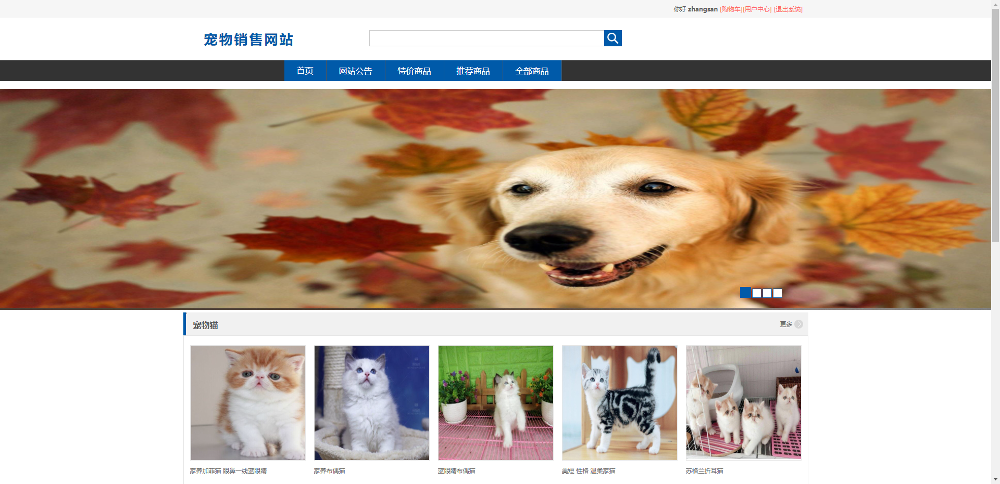
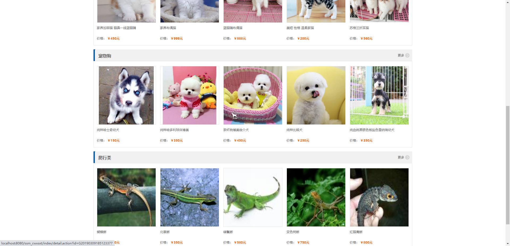
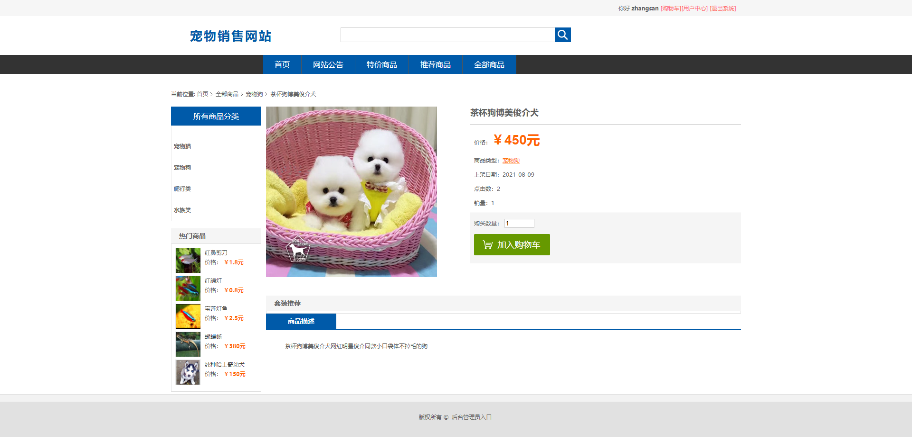
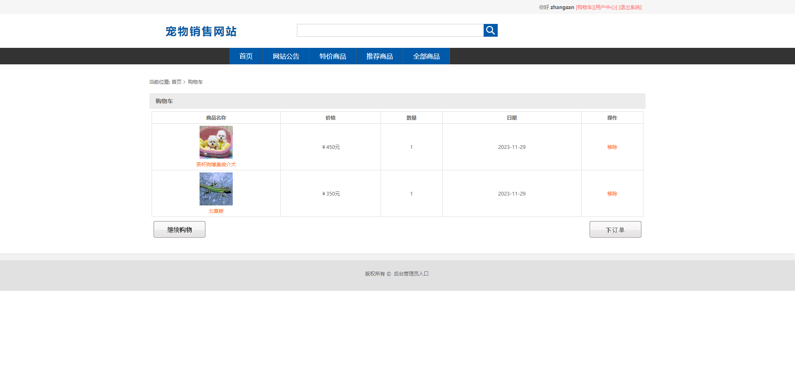
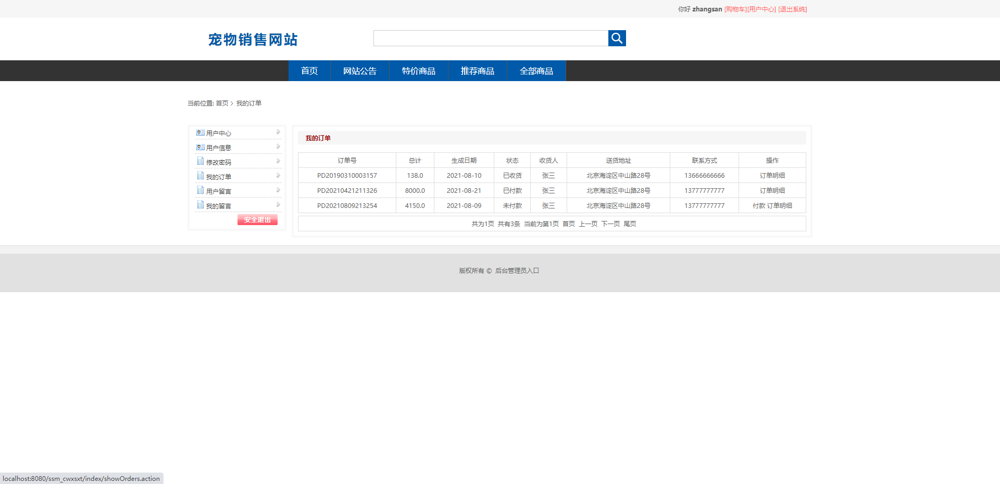
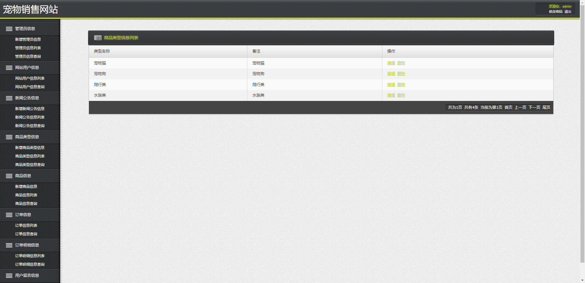
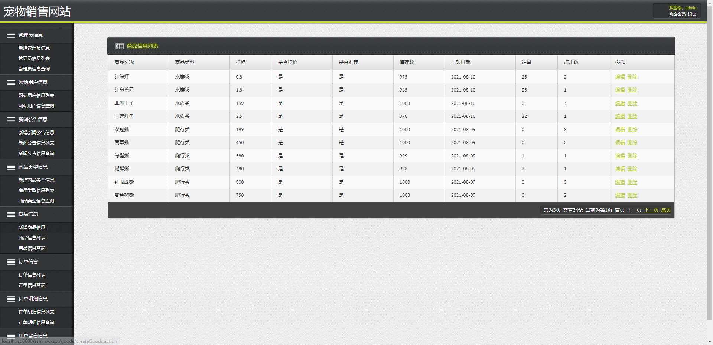
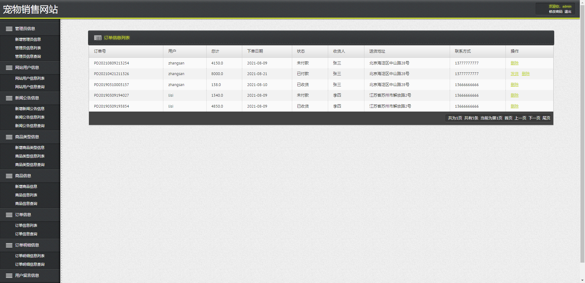
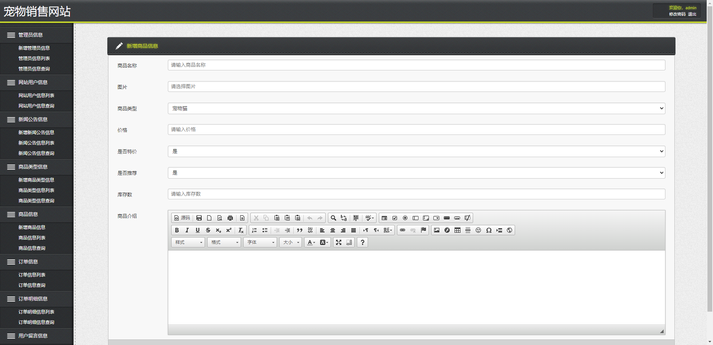

## 基于SSM的网上宠物店

- <b>完整代码获取地址：从戎源码网 ([https://armycodes.com/](https://armycodes.com/))</b>
- <b>技术探讨、资料分享，请加QQ群：692619798</b> 
- <b>作者微信：19941326836  QQ：952045282</b> 
- <b>承接计算机毕业设计、Java毕业设计、Python毕业设计、深度学习、机器学习</b>
- <b>选题+开题报告+任务书+程序定制+安装调试+论文+答辩ppt 一条龙服务</b>
- <b>所有选题地址 ([https://github.com/YuLin-Coder/AllProjectCatalog](https://github.com/YuLin-Coder/AllProjectCatalog)) </b>

## 项目介绍
基于SSM的网上宠物店，由两个大模块组成：前台用户界面和后台管理员界面。
1.前台用户界面主要是分为：
查看部分宠物商品，查看宠物详细信息，查看更多商品，加入购物车，确认订购信息，修改购物车，部分删除购物车信息，清空购物车和提交订单等购物网站常见功能。
2.后台主要是管理员对网站信息的添加，更新、删除和查询。
分为：用户管理、宠物分类管理、宠物信息管理以及订单管理。用户管理包括用户信息查询和删除。商品管理包括商品录入，涉及图片传送功能。订单管理包括查询和删除订单。商品分类管理包括查询商品分类。添加用户身份的验证，商品限定购买数量验证等功能加强了各种信息的安全性。

## 项目技术
- 编程语言：Java
- 数据库：MySQL
- 前端技术：JSP、JavaScript、bootstrap、JQuery
- 后端技术：Spring、SpringMVC、MyBatis

## 运行环境
- JDK版本：JDK1.8及以上
- 开发工具：IDEA、Ecplise、Myecplise都可以
- 数据库: MySQL5.7及以上
- Maven：maven3.0及以上

## 运行截图

